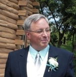
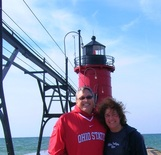
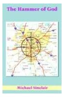
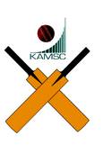

<!--center>
    
    
</center-->

    
        
        
    

 

A <u>very</u> brief history of me: I have been with KAMSC since 1988. I earned two baccalaureate degrees in <i>science education and psychology</i> from Montana State University and a master's degree in <i>mathematics</i> from the Ohio State University. I've also completed post-graduate work in physics, astronomy, and mathematics. Prior to my employment at the Center, I taught at Mattawan High School in Michigan and Mountain View High School in Wyoming.

Over the summers, I have worked at the National Solar Observatory at Sunspot, New Mexico, at Los Alamos National Laboratory as a U.S. Department of Energy Teacher Researcher, at the Fermi National Accelerator Laboratory in Batavia, Illinois, and at the University of Notre Dame and Kalamazoo College as a Teacher Research Associate. I also worked on the Systemic Initiative in Montana Mathematics and Science project and participated in the National Endowment for the Humanities Great Theorems in Mathematics program at the Ohio State University.

I am a past president of the Kalamazoo Astronomical Society and a member of the Astronomical League, the American Association of Physics Teachers, the National Speleological Society, and a Life Member of the Ohio State University Alumni Association.

In 2013, I was named one of six teachers nationwide as a <a href="http://www.kennedy-center.org/programs/awards/sondheim/include/nominees13.html">Kennedy Center/Stephen Sondheim Inspirational Teacher</a> awardee and was the 2006 Michigan High School Science Teacher of the Year. I have also received an Outstanding Alumni Award from the West Michigan chapter of  the Ohio State University Alumni Association, was a recipient of a RadioShack National Teacher Award in 1997, the Hans Baldauf Award from Great Lakes Region of the Astronomical League, and have been recognized with 50 Kalamazoo County Excellence in Education Significant Educator Awards over the past 25 years. I was one of the top 200 teachers selected as a finalist for the NASA Educator Astronaut program in 2004. Finally, I earned National Board Certification through the <a href="http://www.nbpts.org/">National Board for Professional Teaching Standards</a> in 2007.

In my so-called spare time, I enjoy reading, writing (and am the author of "The Hammer of God", a work of self-published speculative fiction and am currently very, very, very slowly working on a second novel), and doing serious amateur astronomy. I am also the proud owner of an Easton carbon nanotechnology baseball bat or, as it's better known by my students, the "nurture stick".

And, last but not least, I am the one and only KAMSC Cricket Team coach and a lifelong Detroit Tigers fan.

    
        
    
     
     
    
        
        
        
    

